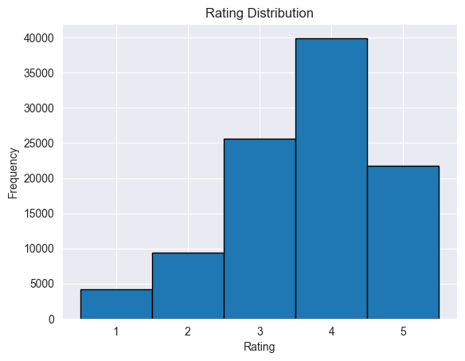
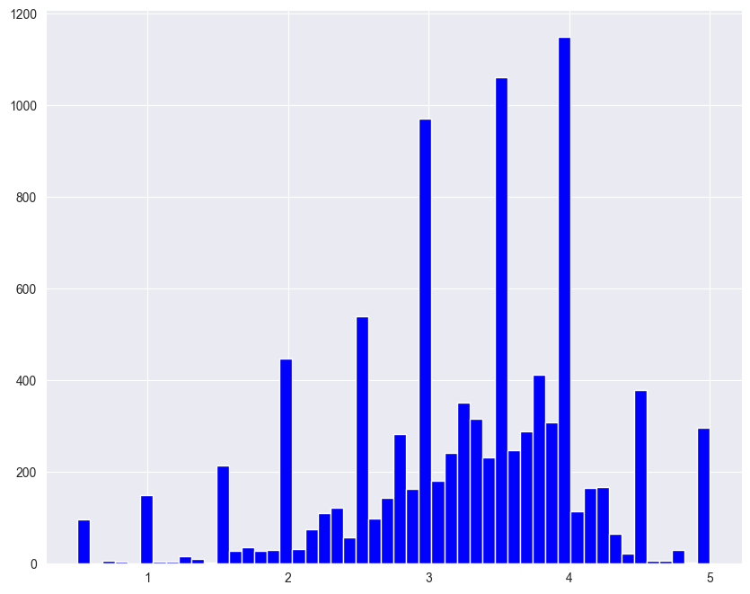
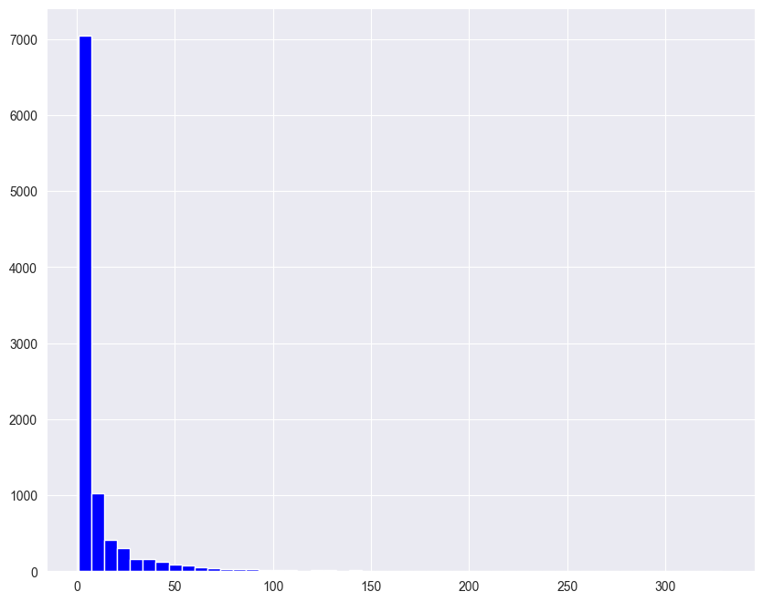
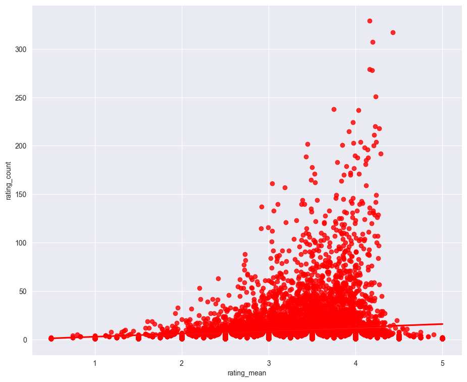

# Movie Recommendation System

### Importing the Libraries


```python
import numpy as np
import matplotlib.pyplot as plt 
import pandas as pd 
import seaborn as sns
```


```python
#pip install scikit-surprise

```

    Collecting scikit-surprise
      Downloading scikit-surprise-1.1.3.tar.gz (771 kB)
         -------------------------------------- 772.0/772.0 kB 9.8 MB/s eta 0:00:00
      Preparing metadata (setup.py): started
      Preparing metadata (setup.py): finished with status 'done'
    Requirement already satisfied: joblib>=1.0.0 in c:\users\prava\anaconda3\lib\site-packages (from scikit-surprise) (1.3.1)
    Requirement already satisfied: numpy>=1.17.3 in c:\users\prava\anaconda3\lib\site-packages (from scikit-surprise) (1.25.0)
    Requirement already satisfied: scipy>=1.3.2 in c:\users\prava\anaconda3\lib\site-packages (from scikit-surprise) (1.11.1)
    Building wheels for collected packages: scikit-surprise
      Building wheel for scikit-surprise (setup.py): started
      Building wheel for scikit-surprise (setup.py): finished with status 'done'
      Created wheel for scikit-surprise: filename=scikit_surprise-1.1.3-cp310-cp310-win_amd64.whl size=1083860 sha256=3aa044d0365254d48749f4537b9b3b01fc3d64aee9d9ea23b4b9b5cfe50ae442
      Stored in directory: c:\users\prava\appdata\local\pip\cache\wheels\df\e4\a6\7ad72453dd693f420b0c639bedeec34641738d11b55d8d9b84
    Successfully built scikit-surprise
    Installing collected packages: scikit-surprise
    Successfully installed scikit-surprise-1.1.3
    Note: you may need to restart the kernel to use updated packages.
    

### Defining the csv file paths and loading them


```python
from surprise import Dataset, Reader
from surprise.model_selection import train_test_split

column_names = ['moviesID','title','genres']

movies_data = pd.read_csv(r'C:\Users\prava\OneDrive\Documents\movies.csv')
rating_data = pd.read_csv(r'C:\Users\prava\OneDrive\Documents\ratings.csv')

print("Movies Data:")
print(movies_data.head())

print("\nRatings Data:")
print(rating_data.head())


```

    Movies Data:
       movieId                               title  \
    0        1                    Toy Story (1995)   
    1        2                      Jumanji (1995)   
    2        3             Grumpier Old Men (1995)   
    3        4            Waiting to Exhale (1995)   
    4        5  Father of the Bride Part II (1995)   
    
                                            genres  
    0  Adventure|Animation|Children|Comedy|Fantasy  
    1                   Adventure|Children|Fantasy  
    2                               Comedy|Romance  
    3                         Comedy|Drama|Romance  
    4                                       Comedy  
    
    Ratings Data:
       userId  movieId  rating  timestamp
    0       1        1     4.0  964982703
    1       1        3     4.0  964981247
    2       1        6     4.0  964982224
    3       1       47     5.0  964983815
    4       1       50     5.0  964982931
    

## From here I will do some more analysis to show the trending movies and Calculate Popularity of movies


```python
reader = Reader(rating_scale=(0.5, 5))  

data = Dataset.load_from_df(rating_data[['userId', 'movieId', 'rating']], reader)

trainset, testset = train_test_split(data, test_size=0.2)
```


```python
def show_trending_movies(num_movies=10):
    most_rated_movies = rating_data['movieId'].value_counts().head(num_movies)
    trending_movies = movies_data[movies_data['movieId'].isin(most_rated_movies.index)]
    return trending_movies
```


```python
def calculate_popularity():
    movie_popularity = rating_data['movieId'].value_counts()
    return movie_popularity
```


```python
def find_highest_rated_movies(num_movies=10):
    average_ratings = rating_data.groupby('movieId')['rating'].mean()
    highest_rated_movie_ids = average_ratings.nlargest(num_movies).index
    highest_rated_movies = movies_data[movies_data['movieId'].isin(highest_rated_movie_ids)]
    return highest_rated_movies
```


```python
trending_movies = show_trending_movies()
print("Trending Movies:")
print(trending_movies)

```

    Trending Movies:
          movieId                                      title  \
    97        110                          Braveheart (1995)   
    224       260  Star Wars: Episode IV - A New Hope (1977)   
    257       296                        Pulp Fiction (1994)   
    277       318           Shawshank Redemption, The (1994)   
    314       356                        Forrest Gump (1994)   
    418       480                       Jurassic Park (1993)   
    461       527                    Schindler's List (1993)   
    507       589          Terminator 2: Judgment Day (1991)   
    510       593           Silence of the Lambs, The (1991)   
    1939     2571                         Matrix, The (1999)   
    
                                    genres  
    97                    Action|Drama|War  
    224            Action|Adventure|Sci-Fi  
    257        Comedy|Crime|Drama|Thriller  
    277                        Crime|Drama  
    314           Comedy|Drama|Romance|War  
    418   Action|Adventure|Sci-Fi|Thriller  
    461                          Drama|War  
    507                      Action|Sci-Fi  
    510              Crime|Horror|Thriller  
    1939            Action|Sci-Fi|Thriller  
    


```python
popularity = calculate_popularity()
print("\nMovie Popularity:")
print(popularity)

```

    
    Movie Popularity:
    movieId
    356       329
    318       317
    296       307
    593       279
    2571      278
             ... 
    86279       1
    86922       1
    5962        1
    87660       1
    163981      1
    Name: count, Length: 9724, dtype: int64
    


```python
highest_rated_movies = find_highest_rated_movies()
print("\nHighest Rated Movies:")
print(highest_rated_movies)
```

    
    Highest Rated Movies:
         movieId                                              title  \
    48        53                                    Lamerica (1994)   
    87        99               Heidi Fleiss: Hollywood Madam (1995)   
    121      148                   Awfully Big Adventure, An (1995)   
    405      467                             Live Nude Girls (1995)   
    432      495  In the Realm of the Senses (Ai no corrida) (1976)   
    433      496                        What Happened Was... (1994)   
    531      626          Thin Line Between Love and Hate, A (1996)   
    536      633                             Denise Calls Up (1995)   
    666      876     Supercop 2 (Project S) (Chao ji ji hua) (1993)   
    865     1140  Entertaining Angels: The Dorothy Day Story (1996)   
    
                                genres  
    48                 Adventure|Drama  
    87                     Documentary  
    121                          Drama  
    405                         Comedy  
    432                          Drama  
    433  Comedy|Drama|Romance|Thriller  
    531                         Comedy  
    536                         Comedy  
    666   Action|Comedy|Crime|Thriller  
    865                          Drama  
    

### Showing a  DIstrbution Plot


```python
def plot_rating_distribution():
    plt.hist(rating_data['rating'], bins=[0.5, 1.5, 2.5, 3.5, 4.5, 5.5], edgecolor='black')
    plt.xlabel('Rating')
    plt.ylabel('Frequency')
    plt.title('Rating Distribution')
    plt.xticks([1, 2, 3, 4, 5])
    plt.show()
```


```python
plot_rating_distribution()
```


    

    


### Analyze the relationship between popularity and average ratings


```python
def analyze_popularity_vs_ratings():
    movie_popularity = calculate_popularity()
    average_ratings = rating_data.groupby('movieId')['rating'].mean()
    
    popularity_vs_ratings = pd.DataFrame({
        'Popularity': movie_popularity,
        'AverageRating': average_ratings
    })
    
    return popularity_vs_ratings
```


```python
popularity_vs_ratings = analyze_popularity_vs_ratings()
print("\nPopularity vs. Average Ratings:")
print(popularity_vs_ratings)

```

    
    Popularity vs. Average Ratings:
             Popularity  AverageRating
    movieId                           
    1               215       3.920930
    2               110       3.431818
    3                52       3.259615
    4                 7       2.357143
    5                49       3.071429
    ...             ...            ...
    193581            1       4.000000
    193583            1       3.500000
    193585            1       3.500000
    193587            1       3.500000
    193609            1       4.000000
    
    [9724 rows x 2 columns]
    

### Merging the movie and the rating dataset on the basis of 'movieId'


```python
merged_movie = pd.merge(movies_data , rating_data , on='movieId')

merged_movie.head()

```


<div>
<style scoped>
    .dataframe tbody tr th:only-of-type {
        vertical-align: middle;
    }

    .dataframe tbody tr th {
        vertical-align: top;
    }

    .dataframe thead th {
        text-align: right;
    }
</style>
<table border="1" class="dataframe">
  <thead>
    <tr style="text-align: right;">
      <th></th>
      <th>movieId</th>
      <th>title</th>
      <th>genres</th>
      <th>userId</th>
      <th>rating</th>
      <th>timestamp</th>
    </tr>
  </thead>
  <tbody>
    <tr>
      <th>0</th>
      <td>1</td>
      <td>Toy Story (1995)</td>
      <td>Adventure|Animation|Children|Comedy|Fantasy</td>
      <td>1</td>
      <td>4.0</td>
      <td>964982703</td>
    </tr>
    <tr>
      <th>1</th>
      <td>1</td>
      <td>Toy Story (1995)</td>
      <td>Adventure|Animation|Children|Comedy|Fantasy</td>
      <td>5</td>
      <td>4.0</td>
      <td>847434962</td>
    </tr>
    <tr>
      <th>2</th>
      <td>1</td>
      <td>Toy Story (1995)</td>
      <td>Adventure|Animation|Children|Comedy|Fantasy</td>
      <td>7</td>
      <td>4.5</td>
      <td>1106635946</td>
    </tr>
    <tr>
      <th>3</th>
      <td>1</td>
      <td>Toy Story (1995)</td>
      <td>Adventure|Animation|Children|Comedy|Fantasy</td>
      <td>15</td>
      <td>2.5</td>
      <td>1510577970</td>
    </tr>
    <tr>
      <th>4</th>
      <td>1</td>
      <td>Toy Story (1995)</td>
      <td>Adventure|Animation|Children|Comedy|Fantasy</td>
      <td>17</td>
      <td>4.5</td>
      <td>1305696483</td>
    </tr>
  </tbody>
</table>
</div>


### Describing the merged data groupby title


```python
merged_movie.groupby('title').describe()
```


<div>
<style scoped>
    .dataframe tbody tr th:only-of-type {
        vertical-align: middle;
    }

    .dataframe tbody tr th {
        vertical-align: top;
    }

    .dataframe thead tr th {
        text-align: left;
    }

    .dataframe thead tr:last-of-type th {
        text-align: right;
    }
</style>
<table border="1" class="dataframe">
  <thead>
    <tr>
      <th></th>
      <th colspan="8" halign="left">movieId</th>
      <th colspan="2" halign="left">userId</th>
      <th>...</th>
      <th colspan="2" halign="left">rating</th>
      <th colspan="8" halign="left">timestamp</th>
    </tr>
    <tr>
      <th></th>
      <th>count</th>
      <th>mean</th>
      <th>std</th>
      <th>min</th>
      <th>25%</th>
      <th>50%</th>
      <th>75%</th>
      <th>max</th>
      <th>count</th>
      <th>mean</th>
      <th>...</th>
      <th>75%</th>
      <th>max</th>
      <th>count</th>
      <th>mean</th>
      <th>std</th>
      <th>min</th>
      <th>25%</th>
      <th>50%</th>
      <th>75%</th>
      <th>max</th>
    </tr>
    <tr>
      <th>title</th>
      <th></th>
      <th></th>
      <th></th>
      <th></th>
      <th></th>
      <th></th>
      <th></th>
      <th></th>
      <th></th>
      <th></th>
      <th></th>
      <th></th>
      <th></th>
      <th></th>
      <th></th>
      <th></th>
      <th></th>
      <th></th>
      <th></th>
      <th></th>
      <th></th>
    </tr>
  </thead>
  <tbody>
    <tr>
      <th>'71 (2014)</th>
      <td>1.0</td>
      <td>117867.0</td>
      <td>NaN</td>
      <td>117867.0</td>
      <td>117867.0</td>
      <td>117867.0</td>
      <td>117867.0</td>
      <td>117867.0</td>
      <td>1.0</td>
      <td>610.000000</td>
      <td>...</td>
      <td>4.000</td>
      <td>4.0</td>
      <td>1.0</td>
      <td>1.493850e+09</td>
      <td>NaN</td>
      <td>1.493850e+09</td>
      <td>1.493850e+09</td>
      <td>1.493850e+09</td>
      <td>1.493850e+09</td>
      <td>1.493850e+09</td>
    </tr>
    <tr>
      <th>'Hellboy': The Seeds of Creation (2004)</th>
      <td>1.0</td>
      <td>97757.0</td>
      <td>NaN</td>
      <td>97757.0</td>
      <td>97757.0</td>
      <td>97757.0</td>
      <td>97757.0</td>
      <td>97757.0</td>
      <td>1.0</td>
      <td>332.000000</td>
      <td>...</td>
      <td>4.000</td>
      <td>4.0</td>
      <td>1.0</td>
      <td>1.352671e+09</td>
      <td>NaN</td>
      <td>1.352671e+09</td>
      <td>1.352671e+09</td>
      <td>1.352671e+09</td>
      <td>1.352671e+09</td>
      <td>1.352671e+09</td>
    </tr>
    <tr>
      <th>'Round Midnight (1986)</th>
      <td>2.0</td>
      <td>26564.0</td>
      <td>0.0</td>
      <td>26564.0</td>
      <td>26564.0</td>
      <td>26564.0</td>
      <td>26564.0</td>
      <td>26564.0</td>
      <td>2.0</td>
      <td>354.500000</td>
      <td>...</td>
      <td>3.500</td>
      <td>3.5</td>
      <td>2.0</td>
      <td>1.346507e+09</td>
      <td>8.718033e+06</td>
      <td>1.340342e+09</td>
      <td>1.343424e+09</td>
      <td>1.346507e+09</td>
      <td>1.349589e+09</td>
      <td>1.352671e+09</td>
    </tr>
    <tr>
      <th>'Salem's Lot (2004)</th>
      <td>1.0</td>
      <td>27751.0</td>
      <td>NaN</td>
      <td>27751.0</td>
      <td>27751.0</td>
      <td>27751.0</td>
      <td>27751.0</td>
      <td>27751.0</td>
      <td>1.0</td>
      <td>345.000000</td>
      <td>...</td>
      <td>5.000</td>
      <td>5.0</td>
      <td>1.0</td>
      <td>1.342827e+09</td>
      <td>NaN</td>
      <td>1.342827e+09</td>
      <td>1.342827e+09</td>
      <td>1.342827e+09</td>
      <td>1.342827e+09</td>
      <td>1.342827e+09</td>
    </tr>
    <tr>
      <th>'Til There Was You (1997)</th>
      <td>2.0</td>
      <td>779.0</td>
      <td>0.0</td>
      <td>779.0</td>
      <td>779.0</td>
      <td>779.0</td>
      <td>779.0</td>
      <td>779.0</td>
      <td>2.0</td>
      <td>229.000000</td>
      <td>...</td>
      <td>4.500</td>
      <td>5.0</td>
      <td>2.0</td>
      <td>1.161440e+09</td>
      <td>2.565208e+08</td>
      <td>9.800520e+08</td>
      <td>1.070746e+09</td>
      <td>1.161440e+09</td>
      <td>1.252133e+09</td>
      <td>1.342827e+09</td>
    </tr>
    <tr>
      <th>...</th>
      <td>...</td>
      <td>...</td>
      <td>...</td>
      <td>...</td>
      <td>...</td>
      <td>...</td>
      <td>...</td>
      <td>...</td>
      <td>...</td>
      <td>...</td>
      <td>...</td>
      <td>...</td>
      <td>...</td>
      <td>...</td>
      <td>...</td>
      <td>...</td>
      <td>...</td>
      <td>...</td>
      <td>...</td>
      <td>...</td>
      <td>...</td>
    </tr>
    <tr>
      <th>eXistenZ (1999)</th>
      <td>22.0</td>
      <td>2600.0</td>
      <td>0.0</td>
      <td>2600.0</td>
      <td>2600.0</td>
      <td>2600.0</td>
      <td>2600.0</td>
      <td>2600.0</td>
      <td>22.0</td>
      <td>389.954545</td>
      <td>...</td>
      <td>4.375</td>
      <td>5.0</td>
      <td>22.0</td>
      <td>1.142416e+09</td>
      <td>1.864260e+08</td>
      <td>9.539264e+08</td>
      <td>1.022392e+09</td>
      <td>1.074911e+09</td>
      <td>1.192657e+09</td>
      <td>1.498528e+09</td>
    </tr>
    <tr>
      <th>xXx (2002)</th>
      <td>24.0</td>
      <td>5507.0</td>
      <td>0.0</td>
      <td>5507.0</td>
      <td>5507.0</td>
      <td>5507.0</td>
      <td>5507.0</td>
      <td>5507.0</td>
      <td>24.0</td>
      <td>272.916667</td>
      <td>...</td>
      <td>3.500</td>
      <td>4.0</td>
      <td>24.0</td>
      <td>1.211263e+09</td>
      <td>1.603298e+08</td>
      <td>1.033172e+09</td>
      <td>1.067739e+09</td>
      <td>1.165147e+09</td>
      <td>1.334983e+09</td>
      <td>1.494267e+09</td>
    </tr>
    <tr>
      <th>xXx: State of the Union (2005)</th>
      <td>5.0</td>
      <td>33158.0</td>
      <td>0.0</td>
      <td>33158.0</td>
      <td>33158.0</td>
      <td>33158.0</td>
      <td>33158.0</td>
      <td>33158.0</td>
      <td>5.0</td>
      <td>386.000000</td>
      <td>...</td>
      <td>2.500</td>
      <td>2.5</td>
      <td>5.0</td>
      <td>1.342892e+09</td>
      <td>1.565114e+08</td>
      <td>1.172026e+09</td>
      <td>1.218169e+09</td>
      <td>1.315243e+09</td>
      <td>1.493848e+09</td>
      <td>1.515172e+09</td>
    </tr>
    <tr>
      <th>¡Three Amigos! (1986)</th>
      <td>26.0</td>
      <td>2478.0</td>
      <td>0.0</td>
      <td>2478.0</td>
      <td>2478.0</td>
      <td>2478.0</td>
      <td>2478.0</td>
      <td>2478.0</td>
      <td>26.0</td>
      <td>279.807692</td>
      <td>...</td>
      <td>3.875</td>
      <td>5.0</td>
      <td>26.0</td>
      <td>1.133275e+09</td>
      <td>1.885839e+08</td>
      <td>9.416414e+08</td>
      <td>9.659981e+08</td>
      <td>1.040513e+09</td>
      <td>1.250966e+09</td>
      <td>1.513132e+09</td>
    </tr>
    <tr>
      <th>À nous la liberté (Freedom for Us) (1931)</th>
      <td>1.0</td>
      <td>5560.0</td>
      <td>NaN</td>
      <td>5560.0</td>
      <td>5560.0</td>
      <td>5560.0</td>
      <td>5560.0</td>
      <td>5560.0</td>
      <td>1.0</td>
      <td>527.000000</td>
      <td>...</td>
      <td>1.000</td>
      <td>1.0</td>
      <td>1.0</td>
      <td>1.033174e+09</td>
      <td>NaN</td>
      <td>1.033174e+09</td>
      <td>1.033174e+09</td>
      <td>1.033174e+09</td>
      <td>1.033174e+09</td>
      <td>1.033174e+09</td>
    </tr>
  </tbody>
</table>
<p>9719 rows × 32 columns</p>
</div>


### Merged data grouped by 'title' and 'rating' mean 


```python
merged_movie.groupby('title')['rating'].mean().head()
```


    title
    '71 (2014)                                 4.0
    'Hellboy': The Seeds of Creation (2004)    4.0
    'Round Midnight (1986)                     3.5
    'Salem's Lot (2004)                        5.0
    'Til There Was You (1997)                  4.0
    Name: rating, dtype: float64


### Merged data grouped by "title" and "rating mean" sorted in descending order


```python
merged_movie.groupby('title')['rating'].mean().sort_values(ascending=False).head()
```


    title
    Gena the Crocodile (1969)              5.0
    True Stories (1986)                    5.0
    Cosmic Scrat-tastrophe (2015)          5.0
    Love and Pigeons (1985)                5.0
    Red Sorghum (Hong gao liang) (1987)    5.0
    Name: rating, dtype: float64


### Merged data grouped by "title" and "rating", displayed by the count of ratings in descending order


```python
merged_movie.groupby('title')['rating'].count().sort_values(ascending=False).head()
```


    title
    Forrest Gump (1994)                 329
    Shawshank Redemption, The (1994)    317
    Pulp Fiction (1994)                 307
    Silence of the Lambs, The (1991)    279
    Matrix, The (1999)                  278
    Name: rating, dtype: int64


### Now We will define "movie_rating_mean_count" in this we will add both the count and mean of the movie ratings in the same table


```python
movie_rating_mean_count = pd.DataFrame(columns=['rating_mean' , 'rating_count'])

movie_rating_mean_count['rating_mean'] = merged_movie.groupby('title')['rating'].mean()

movie_rating_mean_count['rating_count'] = merged_movie.groupby('title')['rating'].count()

movie_rating_mean_count.head()
```


<div>
<style scoped>
    .dataframe tbody tr th:only-of-type {
        vertical-align: middle;
    }

    .dataframe tbody tr th {
        vertical-align: top;
    }

    .dataframe thead th {
        text-align: right;
    }
</style>
<table border="1" class="dataframe">
  <thead>
    <tr style="text-align: right;">
      <th></th>
      <th>rating_mean</th>
      <th>rating_count</th>
    </tr>
    <tr>
      <th>title</th>
      <th></th>
      <th></th>
    </tr>
  </thead>
  <tbody>
    <tr>
      <th>'71 (2014)</th>
      <td>4.0</td>
      <td>1</td>
    </tr>
    <tr>
      <th>'Hellboy': The Seeds of Creation (2004)</th>
      <td>4.0</td>
      <td>1</td>
    </tr>
    <tr>
      <th>'Round Midnight (1986)</th>
      <td>3.5</td>
      <td>2</td>
    </tr>
    <tr>
      <th>'Salem's Lot (2004)</th>
      <td>5.0</td>
      <td>1</td>
    </tr>
    <tr>
      <th>'Til There Was You (1997)</th>
      <td>4.0</td>
      <td>2</td>
    </tr>
  </tbody>
</table>
</div>


### Now we will make a histogram based on the above data, so as to see how the average ratings are distributed


```python
plt.figure(figsize=(10,8))
sns.set_style("darkgrid")

movie_rating_mean_count['rating_mean'].hist(bins=50, color='blue')
```


    <Axes: >


    

    


### Now we will make the distribution for the Ratings Count


```python
plt.figure(figsize=(10,8))
sns.set_style("darkgrid")

movie_rating_mean_count['rating_count'].hist(bins=50, color='blue')
```


    <Axes: >


    

    


We can see that there are more than 7000 movies with less than 10 rating counts , and there are very few movies with rating counts more than 50 

### Now Let's see the relationship between Rating_count and Rating_mean


```python
plt.figure(figsize=(11,9))
sns.set_style("darkgrid")

sns.regplot(x="rating_mean", y="rating_count", data=movie_rating_mean_count, color="red")
```


    <Axes: xlabel='rating_mean', ylabel='rating_count'>


    

    


### Lets see the data  sort by "Rating Count" in the Descending Order 


```python
movie_rating_mean_count.sort_values("rating_count" , ascending=False).head()
```


<div>
<style scoped>
    .dataframe tbody tr th:only-of-type {
        vertical-align: middle;
    }

    .dataframe tbody tr th {
        vertical-align: top;
    }

    .dataframe thead th {
        text-align: right;
    }
</style>
<table border="1" class="dataframe">
  <thead>
    <tr style="text-align: right;">
      <th></th>
      <th>rating_mean</th>
      <th>rating_count</th>
    </tr>
    <tr>
      <th>title</th>
      <th></th>
      <th></th>
    </tr>
  </thead>
  <tbody>
    <tr>
      <th>Forrest Gump (1994)</th>
      <td>4.164134</td>
      <td>329</td>
    </tr>
    <tr>
      <th>Shawshank Redemption, The (1994)</th>
      <td>4.429022</td>
      <td>317</td>
    </tr>
    <tr>
      <th>Pulp Fiction (1994)</th>
      <td>4.197068</td>
      <td>307</td>
    </tr>
    <tr>
      <th>Silence of the Lambs, The (1991)</th>
      <td>4.161290</td>
      <td>279</td>
    </tr>
    <tr>
      <th>Matrix, The (1999)</th>
      <td>4.192446</td>
      <td>278</td>
    </tr>
  </tbody>
</table>
</div>


### Let's See the data sort by "Rating Mean" in the Descending Order


```python
movie_rating_mean_count.sort_values("rating_mean" , ascending=False).head()
```


<div>
<style scoped>
    .dataframe tbody tr th:only-of-type {
        vertical-align: middle;
    }

    .dataframe tbody tr th {
        vertical-align: top;
    }

    .dataframe thead th {
        text-align: right;
    }
</style>
<table border="1" class="dataframe">
  <thead>
    <tr style="text-align: right;">
      <th></th>
      <th>rating_mean</th>
      <th>rating_count</th>
    </tr>
    <tr>
      <th>title</th>
      <th></th>
      <th></th>
    </tr>
  </thead>
  <tbody>
    <tr>
      <th>Gena the Crocodile (1969)</th>
      <td>5.0</td>
      <td>1</td>
    </tr>
    <tr>
      <th>True Stories (1986)</th>
      <td>5.0</td>
      <td>1</td>
    </tr>
    <tr>
      <th>Cosmic Scrat-tastrophe (2015)</th>
      <td>5.0</td>
      <td>1</td>
    </tr>
    <tr>
      <th>Love and Pigeons (1985)</th>
      <td>5.0</td>
      <td>1</td>
    </tr>
    <tr>
      <th>Red Sorghum (Hong gao liang) (1987)</th>
      <td>5.0</td>
      <td>1</td>
    </tr>
  </tbody>
</table>
</div>


## NEW DATAFRAME for Item Based Collaborative Filtering

Let's make a dataframe where each movie is represented by a column and row contains user ratings for movies


```python
movie_rating_matrix = merged_movie.pivot_table(index="userId", columns="title" ,values="rating")

movie_rating_matrix
```


<div>
<style scoped>
    .dataframe tbody tr th:only-of-type {
        vertical-align: middle;
    }

    .dataframe tbody tr th {
        vertical-align: top;
    }

    .dataframe thead th {
        text-align: right;
    }
</style>
<table border="1" class="dataframe">
  <thead>
    <tr style="text-align: right;">
      <th>title</th>
      <th>'71 (2014)</th>
      <th>'Hellboy': The Seeds of Creation (2004)</th>
      <th>'Round Midnight (1986)</th>
      <th>'Salem's Lot (2004)</th>
      <th>'Til There Was You (1997)</th>
      <th>'Tis the Season for Love (2015)</th>
      <th>'burbs, The (1989)</th>
      <th>'night Mother (1986)</th>
      <th>(500) Days of Summer (2009)</th>
      <th>*batteries not included (1987)</th>
      <th>...</th>
      <th>Zulu (2013)</th>
      <th>[REC] (2007)</th>
      <th>[REC]² (2009)</th>
      <th>[REC]³ 3 Génesis (2012)</th>
      <th>anohana: The Flower We Saw That Day - The Movie (2013)</th>
      <th>eXistenZ (1999)</th>
      <th>xXx (2002)</th>
      <th>xXx: State of the Union (2005)</th>
      <th>¡Three Amigos! (1986)</th>
      <th>À nous la liberté (Freedom for Us) (1931)</th>
    </tr>
    <tr>
      <th>userId</th>
      <th></th>
      <th></th>
      <th></th>
      <th></th>
      <th></th>
      <th></th>
      <th></th>
      <th></th>
      <th></th>
      <th></th>
      <th></th>
      <th></th>
      <th></th>
      <th></th>
      <th></th>
      <th></th>
      <th></th>
      <th></th>
      <th></th>
      <th></th>
      <th></th>
    </tr>
  </thead>
  <tbody>
    <tr>
      <th>1</th>
      <td>NaN</td>
      <td>NaN</td>
      <td>NaN</td>
      <td>NaN</td>
      <td>NaN</td>
      <td>NaN</td>
      <td>NaN</td>
      <td>NaN</td>
      <td>NaN</td>
      <td>NaN</td>
      <td>...</td>
      <td>NaN</td>
      <td>NaN</td>
      <td>NaN</td>
      <td>NaN</td>
      <td>NaN</td>
      <td>NaN</td>
      <td>NaN</td>
      <td>NaN</td>
      <td>4.0</td>
      <td>NaN</td>
    </tr>
    <tr>
      <th>2</th>
      <td>NaN</td>
      <td>NaN</td>
      <td>NaN</td>
      <td>NaN</td>
      <td>NaN</td>
      <td>NaN</td>
      <td>NaN</td>
      <td>NaN</td>
      <td>NaN</td>
      <td>NaN</td>
      <td>...</td>
      <td>NaN</td>
      <td>NaN</td>
      <td>NaN</td>
      <td>NaN</td>
      <td>NaN</td>
      <td>NaN</td>
      <td>NaN</td>
      <td>NaN</td>
      <td>NaN</td>
      <td>NaN</td>
    </tr>
    <tr>
      <th>3</th>
      <td>NaN</td>
      <td>NaN</td>
      <td>NaN</td>
      <td>NaN</td>
      <td>NaN</td>
      <td>NaN</td>
      <td>NaN</td>
      <td>NaN</td>
      <td>NaN</td>
      <td>NaN</td>
      <td>...</td>
      <td>NaN</td>
      <td>NaN</td>
      <td>NaN</td>
      <td>NaN</td>
      <td>NaN</td>
      <td>NaN</td>
      <td>NaN</td>
      <td>NaN</td>
      <td>NaN</td>
      <td>NaN</td>
    </tr>
    <tr>
      <th>4</th>
      <td>NaN</td>
      <td>NaN</td>
      <td>NaN</td>
      <td>NaN</td>
      <td>NaN</td>
      <td>NaN</td>
      <td>NaN</td>
      <td>NaN</td>
      <td>NaN</td>
      <td>NaN</td>
      <td>...</td>
      <td>NaN</td>
      <td>NaN</td>
      <td>NaN</td>
      <td>NaN</td>
      <td>NaN</td>
      <td>NaN</td>
      <td>NaN</td>
      <td>NaN</td>
      <td>NaN</td>
      <td>NaN</td>
    </tr>
    <tr>
      <th>5</th>
      <td>NaN</td>
      <td>NaN</td>
      <td>NaN</td>
      <td>NaN</td>
      <td>NaN</td>
      <td>NaN</td>
      <td>NaN</td>
      <td>NaN</td>
      <td>NaN</td>
      <td>NaN</td>
      <td>...</td>
      <td>NaN</td>
      <td>NaN</td>
      <td>NaN</td>
      <td>NaN</td>
      <td>NaN</td>
      <td>NaN</td>
      <td>NaN</td>
      <td>NaN</td>
      <td>NaN</td>
      <td>NaN</td>
    </tr>
    <tr>
      <th>...</th>
      <td>...</td>
      <td>...</td>
      <td>...</td>
      <td>...</td>
      <td>...</td>
      <td>...</td>
      <td>...</td>
      <td>...</td>
      <td>...</td>
      <td>...</td>
      <td>...</td>
      <td>...</td>
      <td>...</td>
      <td>...</td>
      <td>...</td>
      <td>...</td>
      <td>...</td>
      <td>...</td>
      <td>...</td>
      <td>...</td>
      <td>...</td>
    </tr>
    <tr>
      <th>606</th>
      <td>NaN</td>
      <td>NaN</td>
      <td>NaN</td>
      <td>NaN</td>
      <td>NaN</td>
      <td>NaN</td>
      <td>NaN</td>
      <td>NaN</td>
      <td>NaN</td>
      <td>NaN</td>
      <td>...</td>
      <td>NaN</td>
      <td>NaN</td>
      <td>NaN</td>
      <td>NaN</td>
      <td>NaN</td>
      <td>NaN</td>
      <td>NaN</td>
      <td>NaN</td>
      <td>NaN</td>
      <td>NaN</td>
    </tr>
    <tr>
      <th>607</th>
      <td>NaN</td>
      <td>NaN</td>
      <td>NaN</td>
      <td>NaN</td>
      <td>NaN</td>
      <td>NaN</td>
      <td>NaN</td>
      <td>NaN</td>
      <td>NaN</td>
      <td>NaN</td>
      <td>...</td>
      <td>NaN</td>
      <td>NaN</td>
      <td>NaN</td>
      <td>NaN</td>
      <td>NaN</td>
      <td>NaN</td>
      <td>NaN</td>
      <td>NaN</td>
      <td>NaN</td>
      <td>NaN</td>
    </tr>
    <tr>
      <th>608</th>
      <td>NaN</td>
      <td>NaN</td>
      <td>NaN</td>
      <td>NaN</td>
      <td>NaN</td>
      <td>NaN</td>
      <td>NaN</td>
      <td>NaN</td>
      <td>NaN</td>
      <td>NaN</td>
      <td>...</td>
      <td>NaN</td>
      <td>NaN</td>
      <td>NaN</td>
      <td>NaN</td>
      <td>NaN</td>
      <td>4.5</td>
      <td>3.5</td>
      <td>NaN</td>
      <td>NaN</td>
      <td>NaN</td>
    </tr>
    <tr>
      <th>609</th>
      <td>NaN</td>
      <td>NaN</td>
      <td>NaN</td>
      <td>NaN</td>
      <td>NaN</td>
      <td>NaN</td>
      <td>NaN</td>
      <td>NaN</td>
      <td>NaN</td>
      <td>NaN</td>
      <td>...</td>
      <td>NaN</td>
      <td>NaN</td>
      <td>NaN</td>
      <td>NaN</td>
      <td>NaN</td>
      <td>NaN</td>
      <td>NaN</td>
      <td>NaN</td>
      <td>NaN</td>
      <td>NaN</td>
    </tr>
    <tr>
      <th>610</th>
      <td>4.0</td>
      <td>NaN</td>
      <td>NaN</td>
      <td>NaN</td>
      <td>NaN</td>
      <td>NaN</td>
      <td>NaN</td>
      <td>NaN</td>
      <td>3.5</td>
      <td>NaN</td>
      <td>...</td>
      <td>NaN</td>
      <td>4.0</td>
      <td>3.5</td>
      <td>3.0</td>
      <td>NaN</td>
      <td>NaN</td>
      <td>2.0</td>
      <td>1.5</td>
      <td>NaN</td>
      <td>NaN</td>
    </tr>
  </tbody>
</table>
<p>610 rows × 9719 columns</p>
</div>


```python
movie_rating_matrix.shape
```


    (610, 9719)


As we can determine that the dataset contains: 
    610 Unique users and 9719 unique movies

Now lets do movie recommendation based on single and multiple movies

For Single Movie - lets take the example of Shawshank Redemption

We will filter the columns based on the movie ratings by users


```python
Shawshank_Redemption_ratings = movie_rating_matrix["Shawshank Redemption, The (1994)"]
```

Now the correlation between other movies and Shawshank Redemption 


```python
Shawshank_Redemption_correlations = pd.DataFrame(movie_rating_matrix.corrwith(Shawshank_Redemption_ratings), columns=["pf_corr"])
```


```python
Shawshank_Redemption_correlations.sort_values("pf_corr",ascending=False).head()
```


<div>
<style scoped>
    .dataframe tbody tr th:only-of-type {
        vertical-align: middle;
    }

    .dataframe tbody tr th {
        vertical-align: top;
    }

    .dataframe thead th {
        text-align: right;
    }
</style>
<table border="1" class="dataframe">
  <thead>
    <tr style="text-align: right;">
      <th></th>
      <th>pf_corr</th>
    </tr>
    <tr>
      <th>title</th>
      <th></th>
    </tr>
  </thead>
  <tbody>
    <tr>
      <th>Principal, The (1987)</th>
      <td>1.0</td>
    </tr>
    <tr>
      <th>Chi-Raq (2015)</th>
      <td>1.0</td>
    </tr>
    <tr>
      <th>Rififi (Du rififi chez les hommes) (1955)</th>
      <td>1.0</td>
    </tr>
    <tr>
      <th>Robot &amp; Frank (2012)</th>
      <td>1.0</td>
    </tr>
    <tr>
      <th>Rock Star (2001)</th>
      <td>1.0</td>
    </tr>
  </tbody>
</table>
</div>


#### Now we will add Rating count to get more meaningful result


```python
Shawshank_Redemption_correlations = Shawshank_Redemption_correlations.join(movie_rating_mean_count["rating_count"])

Shawshank_Redemption_correlations.head()
```


<div>
<style scoped>
    .dataframe tbody tr th:only-of-type {
        vertical-align: middle;
    }

    .dataframe tbody tr th {
        vertical-align: top;
    }

    .dataframe thead th {
        text-align: right;
    }
</style>
<table border="1" class="dataframe">
  <thead>
    <tr style="text-align: right;">
      <th></th>
      <th>pf_corr</th>
      <th>rating_count</th>
    </tr>
    <tr>
      <th>title</th>
      <th></th>
      <th></th>
    </tr>
  </thead>
  <tbody>
    <tr>
      <th>'71 (2014)</th>
      <td>NaN</td>
      <td>1</td>
    </tr>
    <tr>
      <th>'Hellboy': The Seeds of Creation (2004)</th>
      <td>NaN</td>
      <td>1</td>
    </tr>
    <tr>
      <th>'Round Midnight (1986)</th>
      <td>NaN</td>
      <td>2</td>
    </tr>
    <tr>
      <th>'Salem's Lot (2004)</th>
      <td>NaN</td>
      <td>1</td>
    </tr>
    <tr>
      <th>'Til There Was You (1997)</th>
      <td>NaN</td>
      <td>2</td>
    </tr>
  </tbody>
</table>
</div>


### Let's Remove the NULL values


```python
Shawshank_Redemption_correlations.dropna(inplace=True)
```


```python
Shawshank_Redemption_correlations.sort_values("pf_corr", ascending=False).head()
```


<div>
<style scoped>
    .dataframe tbody tr th:only-of-type {
        vertical-align: middle;
    }

    .dataframe tbody tr th {
        vertical-align: top;
    }

    .dataframe thead th {
        text-align: right;
    }
</style>
<table border="1" class="dataframe">
  <thead>
    <tr style="text-align: right;">
      <th></th>
      <th>pf_corr</th>
      <th>rating_count</th>
    </tr>
    <tr>
      <th>title</th>
      <th></th>
      <th></th>
    </tr>
  </thead>
  <tbody>
    <tr>
      <th>Principal, The (1987)</th>
      <td>1.0</td>
      <td>2</td>
    </tr>
    <tr>
      <th>Chi-Raq (2015)</th>
      <td>1.0</td>
      <td>2</td>
    </tr>
    <tr>
      <th>Rififi (Du rififi chez les hommes) (1955)</th>
      <td>1.0</td>
      <td>2</td>
    </tr>
    <tr>
      <th>Robot &amp; Frank (2012)</th>
      <td>1.0</td>
      <td>3</td>
    </tr>
    <tr>
      <th>Rock Star (2001)</th>
      <td>1.0</td>
      <td>3</td>
    </tr>
  </tbody>
</table>
</div>


### Now We will add rating counts which are more 50 to get the highest correlation with Shawshank Redemption, The (1994


```python
Shawshank_Redemption_correlations_50 = Shawshank_Redemption_correlations[Shawshank_Redemption_correlations['rating_count']>50]

Shawshank_Redemption_correlations_50.sort_values("pf_corr", ascending=False).head()
```


<div>
<style scoped>
    .dataframe tbody tr th:only-of-type {
        vertical-align: middle;
    }

    .dataframe tbody tr th {
        vertical-align: top;
    }

    .dataframe thead th {
        text-align: right;
    }
</style>
<table border="1" class="dataframe">
  <thead>
    <tr style="text-align: right;">
      <th></th>
      <th>pf_corr</th>
      <th>rating_count</th>
    </tr>
    <tr>
      <th>title</th>
      <th></th>
      <th></th>
    </tr>
  </thead>
  <tbody>
    <tr>
      <th>Shawshank Redemption, The (1994)</th>
      <td>1.000000</td>
      <td>317</td>
    </tr>
    <tr>
      <th>Rear Window (1954)</th>
      <td>0.545149</td>
      <td>84</td>
    </tr>
    <tr>
      <th>My Cousin Vinny (1992)</th>
      <td>0.523016</td>
      <td>59</td>
    </tr>
    <tr>
      <th>Bad Boys (1995)</th>
      <td>0.516762</td>
      <td>51</td>
    </tr>
    <tr>
      <th>City of God (Cidade de Deus) (2002)</th>
      <td>0.486670</td>
      <td>75</td>
    </tr>
  </tbody>
</table>
</div>


```python

```
